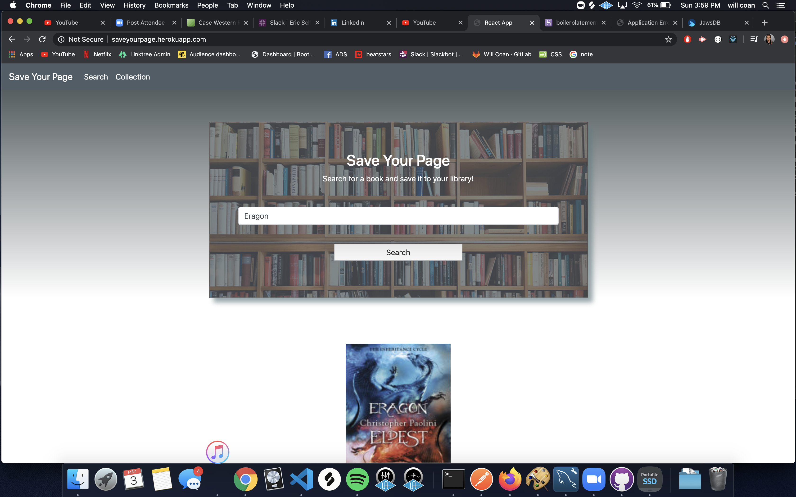
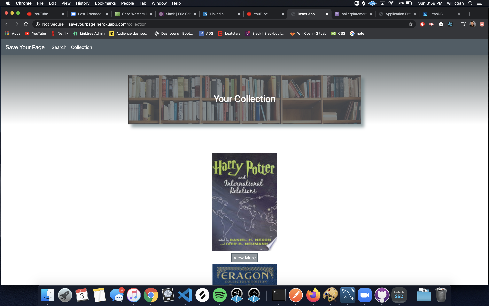

MERN application with socket.io

https://saveyourpage.herokuapp.com/

Search for your favorite book
View more to be able to read the description of the book and be able to
save you to your collection

once you save a book a success alert pops up in every current viewing user's
browser notifying a book has been saved (socket.io)

Once you save a book you'll be able to head over to your collection and be 
able to view it again or delete it from your collection!